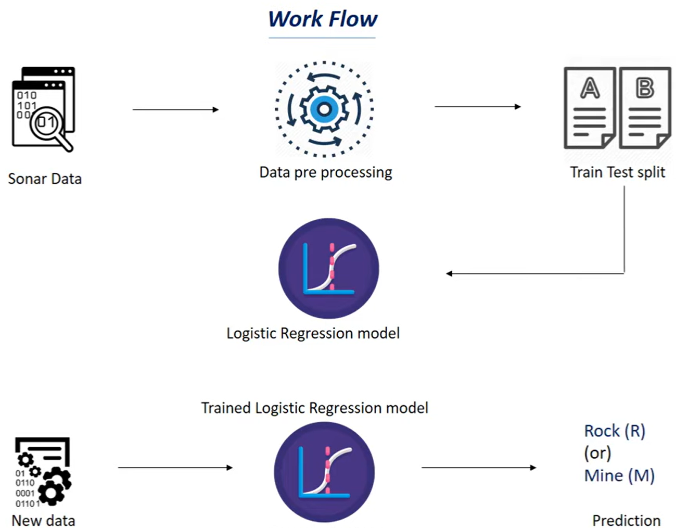

# rockvsmine
Rock vs Mine Prediction with Python | Machine Learning Project

#PROBLEM STATEMENT 

Consider there is a submarine so there is a war going on between two countries so, the submarine of a country is going in know underwater to another country and the enemy country has planted some mines in the ocean, here mines are nothing but explosives that explodes when some object comes in contact with it right so there can also be rocks in the ocean so the submarine needs to predict whether it is crossing a mine or a rock so our task is to make a system that can predict whether the object beneath the Submarine is a mine or a rock so how this has done is the Submarine since a sonar. This sonar [Sound Navigation and Ranging] sends the sound signals and reviews switchbacks so this signal is then processed to detect whether the object is a mine or it is just a rock in the ocean.

#ALGORITHM - SUPERVISED MACHINE LEARNING [LOGISTIC REGRESSION]
